[TOC]

# krgy_juki_holder_user_manual
Juki nozzle tool holder for pnp user manual

# 高精度juki吸嘴快拆连接器铜套座-v8-UM01_产品介绍

## 产品尺寸

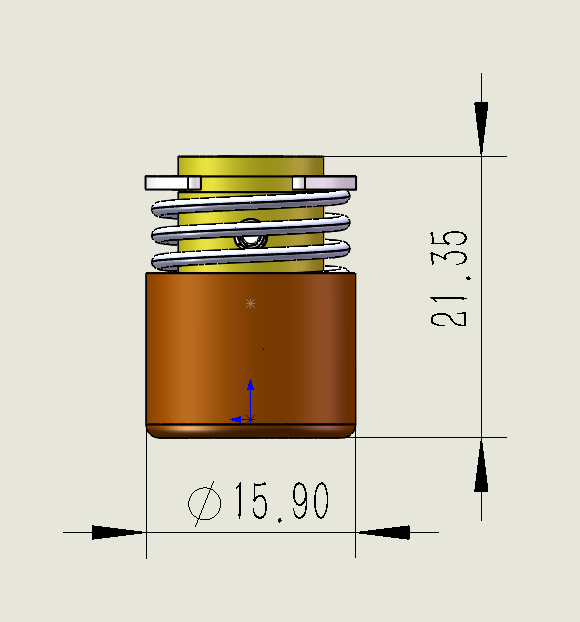

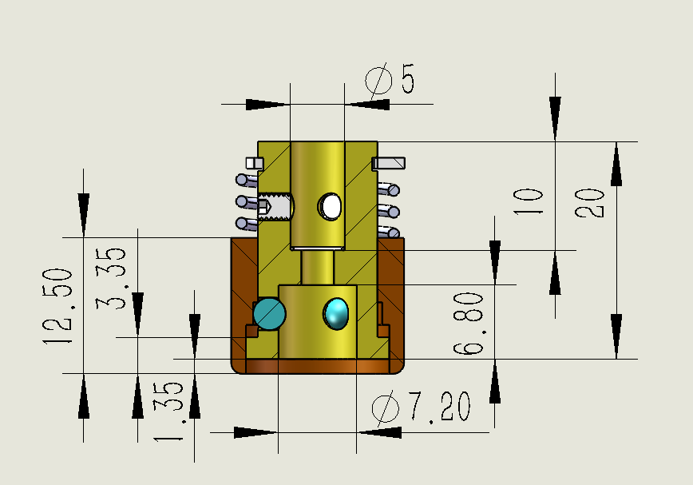

## 产品外观

每一套产品(至多8套1盒)，均提供塑料盒包装。

每套产品及附件都由珍珠棉包裹，防止运输过程中的发生磕碰，可靠保护产品。

附件 : 

​	一把内六角扳手，用于锁紧内套与电机轴之间的3个顶丝。

​	每套产品都附带2个密封环(其中一个为备件)，用于电机轴端面和内套端面之间的密封。

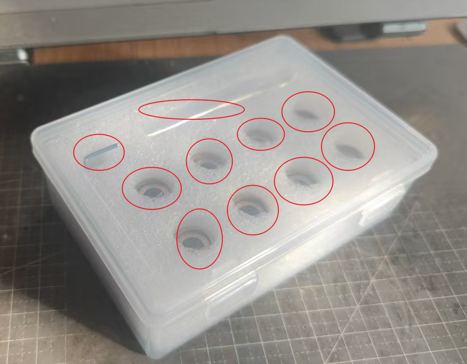

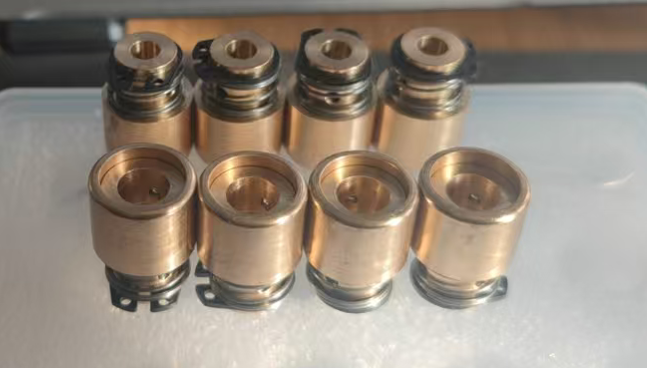

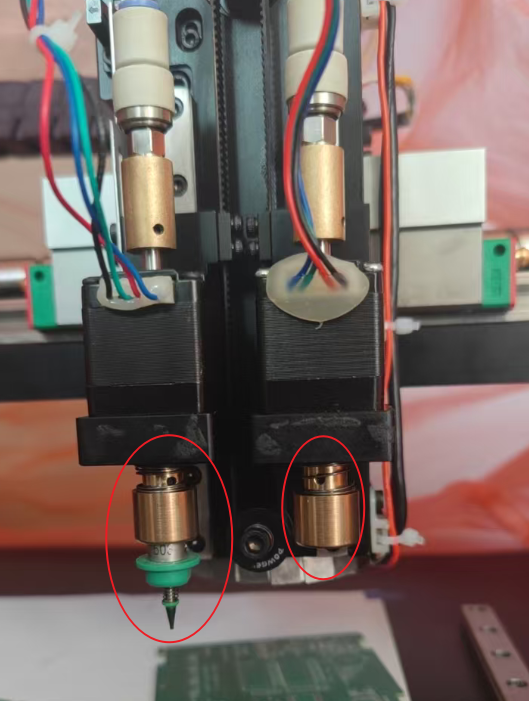

## 产品概述

**高精度juki吸嘴快拆连接器铜套座v8**是**太原科润广原科技有限公司**研发的适用于**自动更换juki吸嘴**和**手工更换juki吸嘴**的贴片机部件。

本公司在研发过程中，对juki吸嘴的快拆用法(基于openpnp)有深入的实践。如果您在自动换吸嘴的过程中遇到问题，请联系我公司，**本公司能给您提供有效的建议和解决方法**。

如果您使用本产品用于自动更换吸嘴，在设备工作平面上，空闲的多个吸嘴可以收纳在3D打印的**吸嘴停靠坞(以下简称吸嘴坞)**中。

本公司提供**吸嘴坞**的solidworks2025图纸源码工程文件(.SLDPRT), 您可以基于这些工程，设计自己的专用吸嘴坞。在提供的资料包中的文档(**高精度juki吸嘴快拆连接器铜套座-v8-UM03_吸嘴坞设计参考文件.pdf**)，有进一步的详细说明。

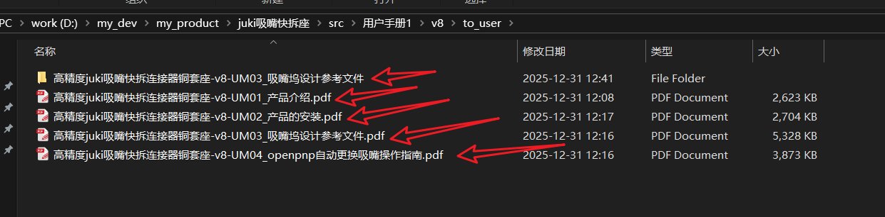

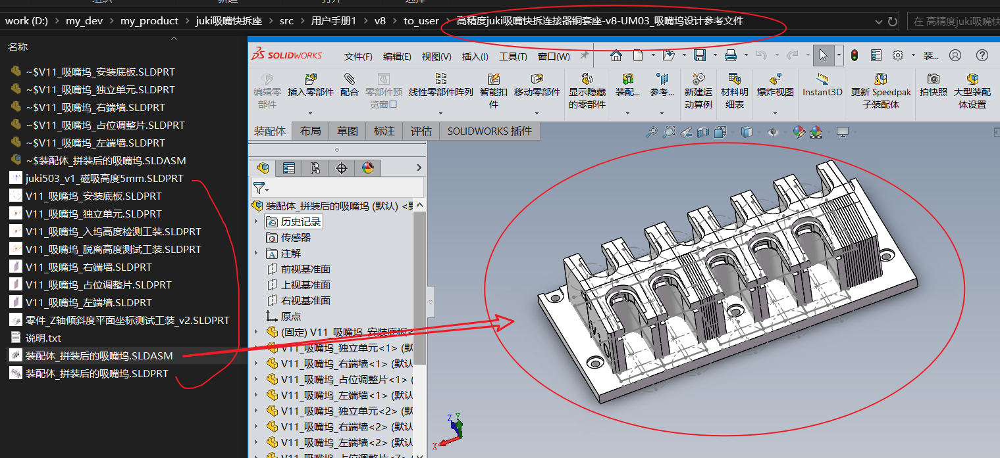

如果您不方便亲自设计您设备的专用吸嘴坞，可以将**吸嘴坞固定螺丝孔和周边限位空间**的**定型定位尺寸**告诉我们，本公司免费为您设计吸嘴坞的专用3D打印模型(提供.step输出文件和.SLDPRT源码工程文件)。并提供**吸嘴坞固定螺丝购买链接**和**吸嘴停靠磁吸用的磁铁购买链接**。

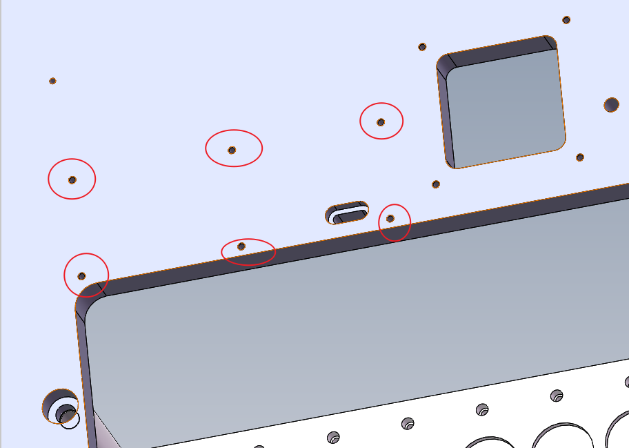

本产品是电机轴和juki吸嘴之间的快拆连接器(手工快速安装/拆卸吸嘴, 自动装载吸嘴/自动卸载吸嘴)，适用电机轴直径为5mm光轴(e.g. 28电机的轴直径是5mm), 适用吸嘴为市面上销售的juki吸嘴(500,501,502,503,504,505,506,507,508...). 

如果本产品不能满足您的需求(e.g. 您的电机轴直径不是5mm, 或者您的电机轴不是光轴，需要螺纹固定...), 都可以咨询本公司，联系方式见我公司提供的其他文档(UM02, UM03, UM04), (或者通过产品购买页面，通过阿里旺旺淘宝站内联系我公司)。

## 产品特点

**高同轴度**: 产品使用高精度CNC数控机床加工，产品装配时采用高精度钢珠和高耐用弹簧, **连接器轴线**和**电机轴线**的同轴误差**小于5个丝**, **连接器轴线**和**吸嘴轴线**的同轴误差**小于5个丝**。

**高密封性**: 每套产品都配有密封环(环截面直径0.5mm，环直径5mm)，用于电机轴下端面和产品内套上端面之间的密封，运行时不漏气。内套下端面和吸嘴进气上端面之间贴合严密，并由高精度钢球自定心进行封闭，运行时不漏气。

**高耐用耐磨**: 产品采用国标铜棒为基材(分为黄铜，锡青铜等多个版本), 非常耐磨耐用。

**手工更换吸嘴的力道轻巧**: 产品外套抬起的力道很轻(小于按下打火机按钮的力道)，外套大约抬起3mm, 就可以将juki吸嘴轻松插入内套。

**自动更换吸嘴顺畅** : 自动更换吸嘴应用时，有些细节需要注意(**公网上没有相关资料，我公司在研发过程中发现并解决**)。**我公司提供自动更换吸嘴应用的细节指南**，请查看文档 <<**高精度juki吸嘴快拆连接器铜套座-v8-UM04_openpnp自动更换吸嘴操作指南.pdf**>>, 可保证自动更换吸嘴时，对吸嘴坞和吸嘴连杆部件均没有冲击，顺滑自动更换吸嘴。

**吸嘴和连接器连接牢固**: 当吸嘴插入产品内套后，将产品外套自然落下，吸嘴被3个钢珠卡住自定心，摩擦力很大，当转动吸嘴时，吸嘴会通过产品带动电机轴一起转动，**绝无任何方向打滑现象的发生**。可以保证吸嘴上吸起元件(e.g.LQFP144的IC)后, 电机轴转动的角度，就是元件转动的角度。

**体积小巧，安装方便, 可无缝替换老式juki吸嘴连接器铜套座**:

下图是**电商平台上的老式juki吸嘴连接器铜套座**(更换吸嘴时，钢珠始终受力，对吸嘴坞和吸嘴连杆的冲击大)。

下图是我公司的**高精度juki吸嘴快拆连接器铜套座-v8**的**安装示意图**，更换吸嘴时，钢珠在完全放松的状态下更换，吸嘴的装载和卸载不受额外的力量约束，吸嘴更换过程顺滑。

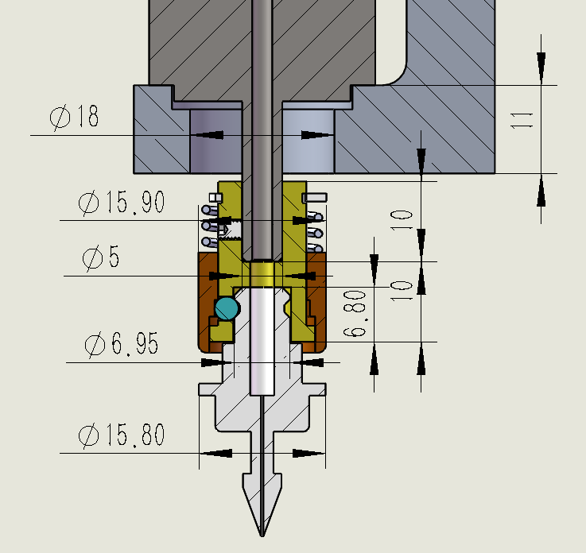

**高精度juki吸嘴快拆连接器铜套座-v8**和**老式juki吸嘴连接器铜套座**进行外形比对，总高度相仿，总直径相仿。如果您使用的是**老式juki吸嘴连接器铜套座**，可以直接拆下来，换上我公司的**高精度juki吸嘴快拆连接器铜套座-v8**，无缝替换。不需要再动设备上其他的部件(e.g. 吸嘴上方的电机不用动, 即使电机L型安装底座厚10mm也不影响)

**价格实惠**: 本产品主体由2个主要零件(外套，内套)组成，其他的小零件(钢珠, 顶丝, 密封圈，弹簧，卡簧)和服务(产品装配测试，为您提供产品咨询服务，为您制作专用吸嘴坞)都不算入价格. 主要零件(外套，内套)如果单独加工，每个零件需要130元以上的加工费用。本公司批量生产，已经将价格打下来了，最终单套均价几乎是单独加工1套价格的一半。最终的单套产品售价仅相当于一个主要零件的价格。如果购买1套以上, e.g. 2套，4套，6套，一盒(8套)，价格更优惠。

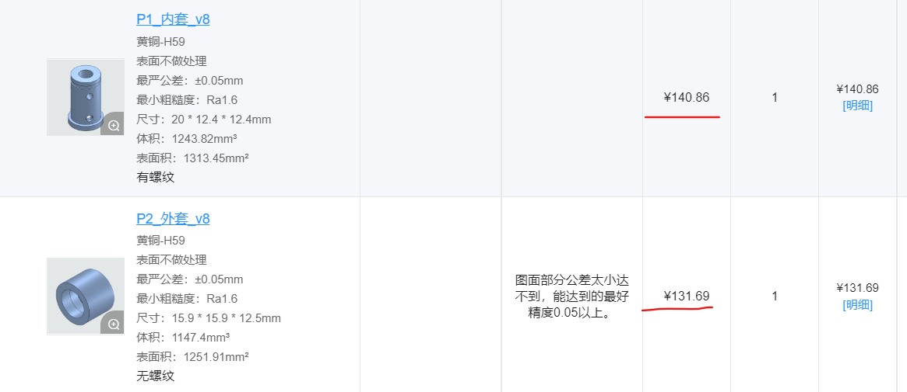

## 其他文档

其他提供给您的文档，都在产品购买后提供，如下:

**高精度juki吸嘴快拆连接器铜套座-v8-UM02_产品的安装**.pdf

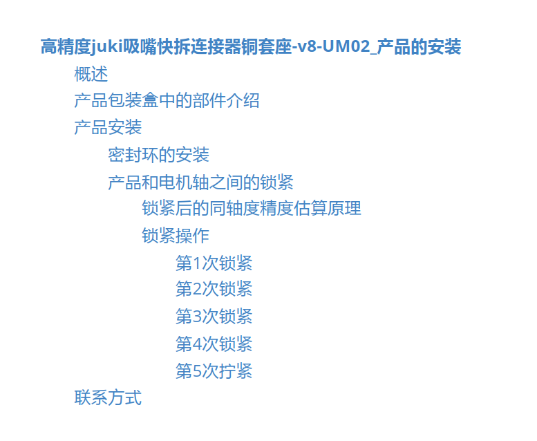

**高精度juki吸嘴快拆连接器铜套座-v8-UM03_吸嘴坞设计参考文件**

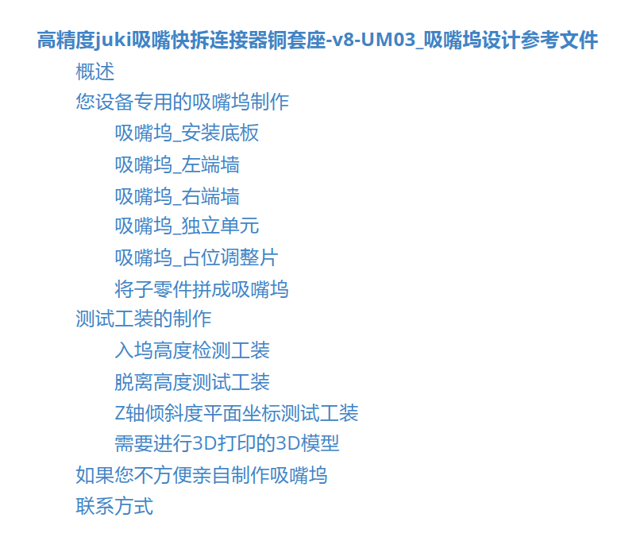

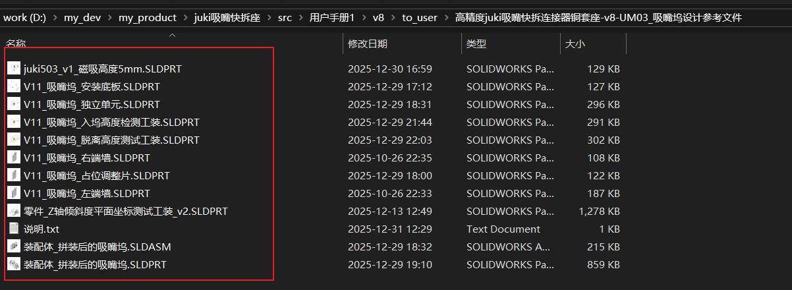

设计文件格式为solidworks2025

设计吸嘴坞和工装的操作请查阅文档 <<**高精度juki吸嘴快拆连接器铜套座-v8-UM03_吸嘴坞设计参考文件.pdf**>>

​	如果您没有安装包，请向我们索要solidworks2025安装包.

​	如果您不方便亲自设计吸嘴坞的3D模型, 会为您免费制作您设备专用的吸嘴坞3D打印设计文件(.step, .SLDPRT), 需要您提供**吸嘴坞固定螺丝孔和周边限位空间**的**定型定位尺寸**

​	3D模型需要的固定大平头螺丝和长方体磁铁的购买链接请查阅文档 <<**高精度juki吸嘴快拆连接器铜套座-v8-UM03_吸嘴坞设计参考文件.pdf**>> 。

**高精度juki吸嘴快拆连接器铜套座-v8-UM04_openpnp自动更换吸嘴操作指南.pdf**

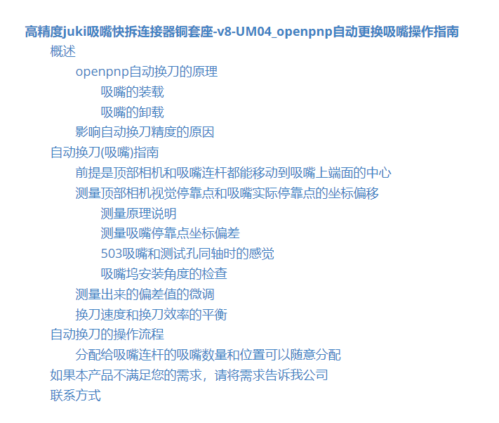

​	在UM04中，会提供自动更换吸嘴的细节处理方法.

​	原因 ： 由于机械安装误差导致吸嘴和吸嘴坞的停靠槽(设备工作平面)不垂直，引起顶部相机看到的吸嘴停靠点和吸嘴实际的停靠点不吻合的问题，如果不处理这个问题，轻则会导致吸嘴载入和卸载时，吸嘴和吸嘴坞发生剐蹭，有异响。重则直接撞刀。

​	处理方法：我公司提供和吸嘴坞配套的工装(需要您3D打印)，按照说明，测试出顶部相机看到的平面坐标(x, y)和吸嘴实际停靠点的偏差(dx, dy)，然后就可以在停靠后的吸嘴中心坐标(x, y)基础上，加上(dx, dy)作为自动更换吸嘴的第1点坐标，就可以准确的让吸嘴内套落到吸嘴上，不会发生剐蹭。

​	还有自动更换吸嘴的速度问题，这个速度有讲究。原因还是机械安装问题，引起的吸嘴连杆和吸嘴坞停靠槽不垂直的问题。但是合理设置分阶段的贴头运动速度，可以使自动换刀的安全性和工作效率得到平衡。

上述的文档(UM03,  UM04)在公网上无法找到，是我公司在研发过程中解决问题后，总结出的文档。如果您需要自动更换吸嘴的功能(**保证自动换刀的绝对安全性，且兼顾自动换刀效率**)，**本产品(包括产品文档)一定会为您带来助力**。

**若您对本自动换刀(吸嘴)产品感兴趣，或有任何本文档未涵盖的技术细节需进一步了解，恭候您的垂询。**

联系方式见我公司提供的其他文档(UM02, UM03, UM04), (或者通过产品购买页面，通过阿里旺旺淘宝站内联系我公司)。

如果不知道我家淘宝店在哪里，可以在淘宝首页搜索关键字"**高精度juki吸嘴快拆连接器铜套座**", 点击商品页面进入，如果看到店家是"**太原科润广原**"，就找到我公司淘宝店了。在淘宝首页，直接搜店铺"**太原科润广原**"亦可.

## 产品购买连接

[https://item.taobao.com/item.htm?spm=a21dvs.23580594.0.0.4fee2c1bNLDle8&ft=t&id=1010034112339](https://item.taobao.com/item.htm?spm=a21dvs.23580594.0.0.4fee2c1bNLDle8&ft=t&id=1010034112339)
